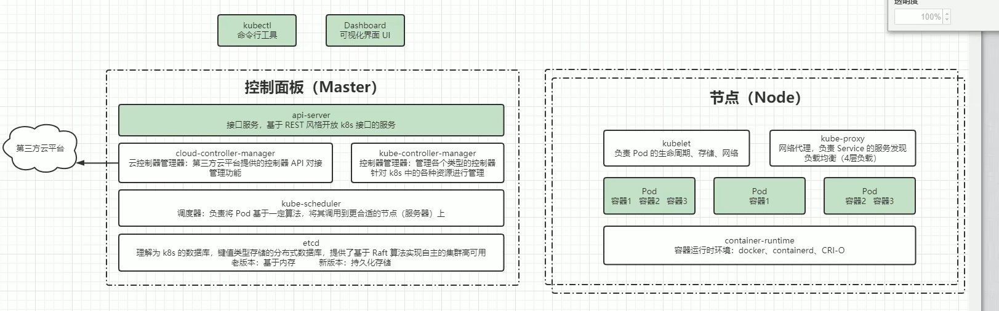

# K8S的组件详解
  - 整体的图示:   
  - 其中用颜色标注的是我们后续的学习重点

  ## 控制面板(Master)中的组件
  
  ### kube-apiserver
  - 基于Restful风格的对外开放的k8s接口接口服务

  ### kube-controller-manager
  - 控制器管理器,是一个控制平面的组件,负责运行控制器进程;从逻辑上讲,每个控制器都是一个单独的进程,但是为了降低复杂性,它们都被编译到同一个可执行文
  件,并在同一个进程中运行;
  - 这些控制器包括:
    - 节点控制器(Node Controller): 负责在节点出现故障时进行通知和响应
    - 任务控制器(Job Controller): 监测代表一次性任务的job对象,然后创建Pods来运行这些任务直至完成
    - 端点分片控制器(EndpointSlice Controller): 填充端点分片(EndpointSlice)对象(以提供Service和Pod之间的链接)
    - 账号服务控制器(ServiceAccount Controller): 为新的命名空间创建默认的服务账号(ServiceAccount)
  - 管理各个类型的控制器;帮助我们管理pod、node、任务、调度,针对k8s中的各种资源进行管理

  ### cloud-controller-manager
  - 云控制器管理器————第三方云平台提供的控制器API对接管理功能,即K8S和这些第三方云平台直接的链接是通过云控制器管理器来实现的

  ### kube-scheduler
  - 调度器: 负责将Pod基于一定算法,将其调用到更合适的节点(服务器)上

  ### etcd
  - 可以理解为K8S的数据库,但它不是一个传统意义上的数据库,是一个键值类型存储的分布式数据库,提供了基于Raft算法实现自主的集群高可用;
  - 老版本是基于内存的,新版本是持久化存储的

  ## 普通节点(Node)中的组件
  
  ### kubelet
  - 负责Pod的生命周期、存储、网络接口的管理

  ### kube-proxy
  - 网络代理,负责service的服务发现以及负载均衡(4层负载即网络层的负载均衡)

  ### container-runtime
  - 容器的运行时环境,可以类比为java中的jre
  - 目前用的比较多的就是docker、containerd、CRI-O

  ### Pod 
  - 一个服务器相当于一个Node,一个Node可以有多个Pod,一个Pod里可以有多个容器,但至少要有一个容器

  ## 附加组件

  ### kube-dns
  - 负责为整个集群提供DNS服务

  ### Ingress Controller
  - 为服务提供外网入口

  ### Prometheus
  - 提供资源监控
 
  ### Dashboard
  - 控制台

  ### Federation
  - 提供跨可用区的集群,即可以帮我们进行集群间的调度

  ### Fluentd-elasticsearch
  - 提供集群日志采集、存储与查询