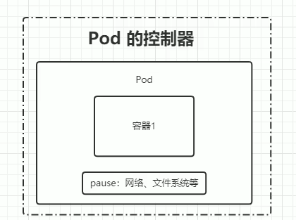

# 命名空间级别资源之工作负载型Pod

# 工作负载型 Pod
  - Pod(容器组)是Kubernetes中最小的可部署单元;一个Pod包含了一个应用程序容器(某些情况下是多个容器)、存储资源、一个唯一的网络IP地址、以及一些
  确定容器该如何运行的选项;Pod容器组代表了Kubernetes中一个独立的应用程序运行实例,该实例可能由单个容器或者几个紧耦合在一起的容器组成;
  - Docker是Kubernetes Pod中使用最广泛的容器引擎,但Kubernetes也支持其他类型的容器引擎

  ## kubernetes集群中的Pod存在如下两种使用途径
  - 一个Pod只运行一个容器;"one-container-per-pod"是Kubernetes中最常见的使用方式;此时,您可以认为Pod容器组是该容器的wrapper,Kubernetes
  通过Pod管理容器,而不是直接管理容器
  - 一个Pod中运行多个需要互相协作的容器,您可以将多个紧密耦合、共享资源且使用在一起的容器编排在同一个Pod中

  ## Pod中的资源 

1.   ## Replicas
     - 一个Pod可以被复制成多份,每一份可被称之为一个"副本",这些"副本"除了一些描述性的信息(Pod的名字、uid)不一样以外,其他信息都是一样的;
     - Pod的"控制器"通常包含一个名为"replicas"的属性,"replicas"属性则指定了特定Pod的副本的数量,当当前集群中该Pod的数量与该属性指定的值不一致
   时,k8s会采取一些策略去使当前状态满足配置的要求

2.   ## 控制器
     - 示意图
     - 控制器的类型大概可以分为四种: 适用于无状态服务、适用于有状态服务、守护进程、任务/定时任务 
     - 比如可以用适用于无状态服务的控制器去构建nginx、可以用有状态服务的控制器去构建redis、mysql
     
     ### 无状态服务的控制器

     #### ① ReplicationController(RC)
     - 帮助我们动态更新Pod的数量
     - RC是k8s中的核心概念之一,简单来说,RC可以保证在任意时间运行Pod的副本数量,能够保证Pod总是可用的,如果实际Pod数量比指定的多(这个指定的就是
     来自于我们上面的配置replicas)那就结束掉多余的,如果实际数量比指定的少就新启动一些Pod;当Pod失败、被删除或挂掉后,RC都会去自动创建新的Pod来
     保证副本数量,所以即使只有一个Pod,我们也应该使用RC来管理我们的Pod;可以说,通过ReplicationController,k8s实现了Pod的高可用性
    
     #### ② ReplicaSet(RS),已取代RC
     - 帮助我们动态的更新Pod的数量,可以通过selector来选择对那些Pod生效
     - RS相比于RC的好处在于,RS可以选择一组标签(selector),而RC只能选择一个;因为RC只能支持selector的等式匹配,而RS还可以通过集合方式匹配;

     #### ③ deployment ※※※
     - 针对RS的更高层次的封装,提供了更丰富的部署相关的功能
     - 可以自动创建RS、自动创建Pod
     - Pod内运行的容器的变更会自动触发Pod的升级,并且支持回滚
     - 平滑的扩容/缩容
     - 可以对Pod进行暂停与恢复
 
     ### 有状态服务的控制器

     #### StatefulSet
     - 专门针对有状态服务进行部署的一个控制器,它有几个特点:
       - 稳定的持久化存储,依赖VolumeClaimTemplate
       - 稳定的网络标志,依赖Headless Service
       - 有序部署,有序扩展: Pod是有顺序的,在部署时会根据Pod的顺序依次进行
       - 有序收缩,有序删除;
     
     - StatefulSet有两个核心配置,分别是Headless Service 和 VolumeClaimTemplate
       - Headless Service: 对于有状态服务的DNS管理,解决了有状态服务的网络问题
       - VolumeClaimTemplate: 用于创建持久化卷的模板,解决了有状态服务的存储问题

  ### 守护进程 DaemonSet
  - DaemonSet保证在每个Node上都运行一个容器副本(Pod),常用来部署一些集群的日志、监控或者其他系统管理应用,典型的包括:
    - 日志收集,比如 fluentd,logstash等
    - 系统监控,比如 Prometheus Node Exporter,collected,New Relic agent,Ganglia gmond等
    - 系统程序,比如 kube-proxy,kube-dns,glusterd,ceph等
     
  ### 任务/定时任务
  - Job: 一次性任务,运行完成后Pod销毁,不再重新启动新容器
  - CronJob: 定时任务,运行完成后Pod销毁

