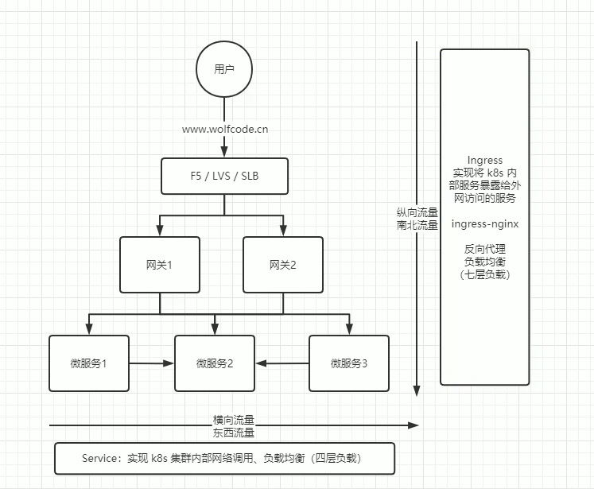
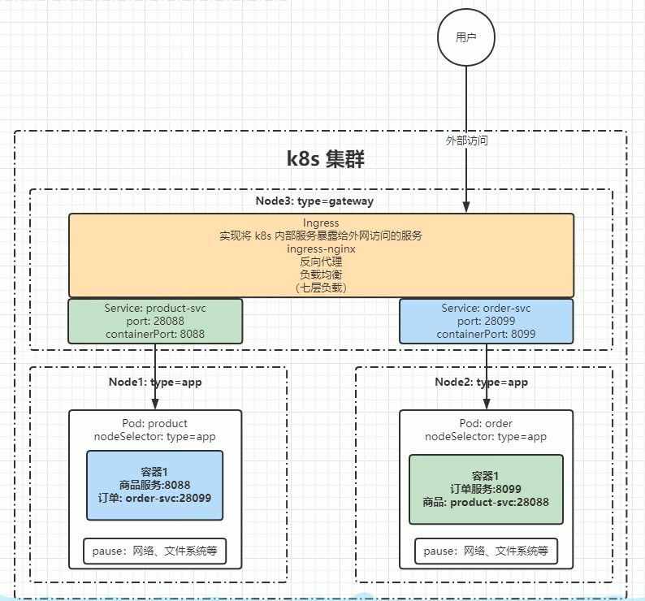

# 除Pod的其他的命名空间级别资源
  
  ## 命名空间级别资源之服务发现————Service、Ingress
  - 图示
  - 
  - 根据上图需要理解东西流量和南北流量的区别,所谓东西流量([狭义、纯个人理解])指的就是在一个网络下的多个Pod之间服务的相互调用;而南北流量则是用户
  从外网来访问我们对外暴露的服务端口,这个过程中会涉及到负载均衡、反向代理和网关等内容

  ### Service
  - 处理东西流量
  - Service简写svc
  - Pod不能直接提供给外网访问,而是应该使用Service;Service就是把Pod暴露出来提供服务,Service才是真正的"服务";
  - 可以说Service是一个应用服务的抽象,定义了Pod逻辑集合和访问这个Pod集合的策略;Service代理Pod集合,对外表现为一个访问入口,访问该入口的请求将
  经过负载均衡,转发到后端Pod中的容器
  - 实现了k8s集群内部网络调用、负载均衡(四层负载)

  ### Ingress
  - 处理南北流量
  - 将k8s内部服务暴露给外网访问的服务,例如通过其内部功能:ingress-nginx实现反向代理、负载均衡(七层负载)

  ### Service、Ingress整合理解示意图
  - 
  - 可以看到在图中,商品服务通过一个product-svc的service接口暴露了一个service的端口28088,而这个28088端口映射的就是商品服务本身暴露的端口8088,
  这样订单服务就可以通过访问product-svc的28088端口,进而访问到商品服务的8088端口,从而实现两个微服务之间的通信;反之,订单服务也是一样
  - 而Ingress则是给外部用户暴露一个公网端口,也可能是个域名,但只有通过Ingress才可以向外部暴露一个访问的入口;
  

  ## 命名空间级别资源之存储————Volume、CSI
  
  ### Volume
  - 数据卷,共享Pod中容器使用的数据,用来存放持久化的数据,比如数据库数据

  ### CSI
  - Container Storage Interface是由多个社区联合制定的一个行业标准接口规范,旨在将任意存储系统暴露给容器化应用程序
  - CSI规范定义了存储提供商实现CSI兼容的Volume Plugin的最小操作集和部署建议,CSI规范的主要焦点是声明Volume Plugin必须实现的接口
  - 个人理解:定义了一套规范,这套规范类似于java中的jdbc,无论你是什么插件,只要你遵循CSI的规范,就可以实现在k8s中应用

  ## 命名空间级别资源之配置————ConfigMap、Serect、DownwardAPI

  ### ConfigMap
  - ConfigMap是一种用于存储非敏感配置数据的API对象
  - 它允许你将配置文件、环境变量和其他配置数据与容器镜像分开,从而使得你的应用程序更加灵活和可配置
  - 使用ConfigMap可以将配置数据注入到Pod中,而不需要将这些数据硬编码到应用程序中

  ### Secret
  - 功能跟ConfigMap类似
  - 旨在解决密码、token、密钥等敏感数据的配置问题,不需要把这些敏感数据暴露到镜像或者Pod Spec中

  ### DownwardAPI
  - 这个模式和其他模式不一样的地方在于它不是为了存放容器的数据也不是用来进行容器和宿主机的数据交换的,而是让Pod里的容器能够直接获取到这个Pod对象
  本身的一些信息
  - DownwardAPI提供了两种方式用于将Pod的信息注入到容器内部
    - 环境变量: 用于单个变量,可以将Pod信息和容器信息直接注入容器内部
    - volume挂载: 将Pod信息生成为文件,直接挂载到容器内部中去

  ## 命名空间级别资源之角色————Role、RoleBinding
  
  ### Role
  - Role是一种角色定义,它定义了一组命名空间级别的权限,作用域命名空间之内

  ### RoleBinding
  - RoleBinding可以作用于Role或者ClusterRole、ClusterRoleBinding也可以作用于Role和ClusterRole
  - 而二者的区别在于,RoleBinding只能将角色绑定到命名空间上,而ClusterRoleBinding可以将角色绑定到集群上;